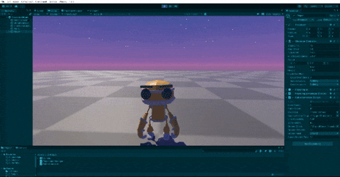
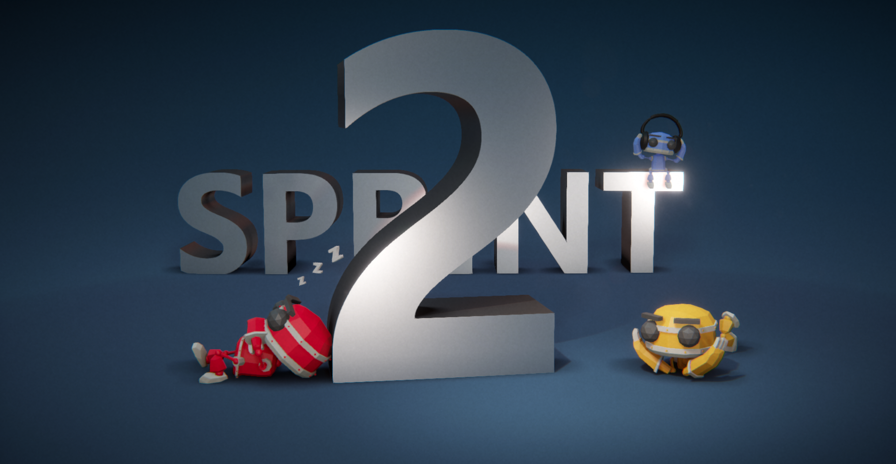

  

## Team Name

## Team Members
- ***Mustafa Said Güngör*** - Product Owner
- ***Öykü Beliz Öztürk*** - Scrum Master
- ***Özlem Arslan*** - Developer

## Game Name
Robotic Resurrection

## Product Backlog List
- [U41 Unity Trello Sprint Board - 1](https://trello.com/b/LAfo7UeH/1-sprint)
- [U41 Unity Trello Sprint Board - 2](https://trello.com/b/VnaWjqj8/2-sprint)
- [U41 Unity Trello Sprint Board - 3](https://trello.com/b/Sc7AtCNH/3-sprint)

## Game Description
In Robotic Resurrection, players control a cute, determined robot named Bolt who must navigate a small desert planet to find and reassemble his robot friend, Jolt, after a spaceship crash. The game combines elements of exploration, adventure and platforming.

Players will guide Bolt through the desert filled with challenges and obstacles. Bolt will encounter platforming sections that test agility and enemies to fight. Along the way, Bolt will collect parts of his robot friend and assemble Jolt.

## Game Features
- 3D
- Singleplayer
- Story Driven Game
- Adventure
- Action RPG
- Offline

## Target Group
- 7 + 
- Children: The game’s cute aesthetic, simple controls, and heartwarming story make it appealing to younger players.
- Parents and Families: The non-violent, positive themes make it a suitable choice for family gaming sessions.
- Casual Gamers: The easy-to-pick-up gameplay and charming characters attract those looking for a lighthearted and enjoyable experience.

## Links
- [Download Game on itch.io](https://tutogamesrr.itch.io/robotic-resurrection)
- [Watch Trailer on Youtube](https://www.youtube.com/watch?v=O2-kPlbwwa4)
- [Listen OST Album on Youtube](https://www.youtube.com/watch?v=NIsI34rYfp8)
- [Game Design Document](https://docs.google.com/document/d/1lFQCjJ4gcxiS0oczOODph1Gs79YmVYuU9dlZmdvwNWE/edit?usp=sharing)
- [Used Assets](https://docs.google.com/document/d/1xz2rqYyFN4JcZB2ymjXu9eHQWj5EaFOzQhHTwpgjlgY/edit?usp=sharing)

---
# **SPRINT 1**

   |  |
   |:---------------------------------:|

- It has been decided that the score evaluation for the sprint will be 20.
- Score completion logic: The backlog score that must be completed throughout the project is expected to be 50. The number of points to be completed for the first Sprint was determined as 20, and the target score was reached by obtaining 20 points.

### **Sprint 1 Notes**
- At the beginning of the first sprint the team has presented different ideas and decided the basic elements of the game.
- The tasks were decided afterwards. 

  **To Do List:**
- Designing the game map
- Coding the character mechanics
- Programming the character animations
- Programming enemy’s AI logic

### **Sprint 1 Board**
   |  |
   |:---------------------------------:|
   | Sprint 1 board                         |

### **Daily Scrum**

* Daily scrum was held via WhatsApp and Discord. Discord meeting notes can be found on Trello as cards in the "Meeting Logs" list.

   |  |
   |:---------------------------------:|
   | Initially, communication was established via WhatsApp, and WhatsApp was preferred for daily communication                         |

   |  |
   |:---------------------------------:|
   | Discord was preferred for planning and collaborative work.                         |

   |  |
   |:---------------------------------:|
   | Recordings of Discord meetings can be found on Trello as cards in the "Meeting Logs" list                         |

   |  |
   |:---------------------------------:|
   | Trello meeting logs                        |

  
### **Development Progress**
* The character's basic movements such as walking, running and jumping were coded. Motion animations and 3rd person camera are programmed.

   |  |  |
   |:---------------------------------:|:-----------------------------------:|
   | Basic movements were coded                        | Motion animations are programmed                        |

* Attack and death mechanics have been coded. Animations are programmed. The character was provided to walk and run smoothly on inclined ground.

   |  |  |
   |:---------------------------------:|:-----------------------------------:|
   | Walking mechanics on inclined ground have been made smoother                        | Attack and death mechanics have been coded                         |

* Map sketch was created.

   |  |
   |:---------------------------------:|
   | Sketch of the game map                        |

* The design of the game map has started.

   |  |
   |:---------------------------------:|
   | Basic elements of the game map                        |

* The loading scene image has been prepared.

   |  |
   |:---------------------------------:|
   | Loading scene image prepared                         |

 ### **Sprint Review**
- At the end of Sprint 1, the team met and the Sprint was reviewed. The intended tasks have all been completed. 
Sprint Review participants: Mustafa Said Güngör, Özlem Arslan, Öykü Beliz Öztürk

 ### **Sprint Retrospective**
- The score for Sprint 1 is 20.
- It was decided to complete the map in the 2nd Sprint.
- The character's mechanics are coded and its animations are programmed.
- Enemy's AI logic is programmed.
- The team discussed the next steps, the tasks of completing the map and completing the cinematic images to be used for the beginning were added to the to do list of the second sprint.
- It was decided that communication among team members should be increased in future sprints.

---
# **SPRINT 2**

   |  |
   |:---------------------------------:|

- It has been decided that the score evaluation for the sprint will be 15.
- Score completion logic: The backlog score that must be completed throughout the project is expected to be 50. The number of points to be completed for the second Sprint was determined as 15, and the target score was reached by obtaining 15 points.

### **Sprint 2 Notes**
- At the beginning of the second sprint the team has discussed which tasks will be completed in the second sprint. 

  **To Do List:**
- Deciding the character's names and functions
- Writing the game's story and lore 
- Revising the map and drawing the final sketch
- Preparing the mini map
- Finding reference pictures
- Preparing async multi-scene loading system 
- Adjusting occlusion culling
- Preparing Game Design Document
- Designing UI
- Preparing game Icons
- Creating cinematic footage for the beginning
- Finishing basic environment design
- Finding new assets for additional enemies.

### **Sprint 2 Board**
   |  |
   |:---------------------------------:|
   | Sprint 2 board                         |

### **Daily Scrum**

* Daily scrum was held via WhatsApp and Discord. Discord meeting notes can be found on Trello as cards in the "Meeting Logs" list.

   |  |
   |:---------------------------------:|
   | WhatsApp meeting logs 1                        |

   |  |
   |:---------------------------------:|
   | WhatsApp meeting logs 2                        |

   |  |
   |:---------------------------------:|
   | Discord meeting logs                        |

   |  |
   |:---------------------------------:|
   | Trello meeting logs                        |

  
### **Development Progress**
* To improve optimization, the "Async Multi-Scene Loading" system was prepared and "Occlusion Culling" settings were adjusted.

   |  |  |
   |:---------------------------------:|:-----------------------------------:|
   | Async multi-scene loading system prapered                      | Occlusion culling adjusted                       |

* The open world map design of the game has been completed

   |  |  |
   |:---------------------------------:|:-----------------------------------:|
   | The open world map design of the game has been completed                       | Open world map                      |

* Final map sketch was created.

   |  |
   |:---------------------------------:|
   | Final Map Sketch                        |

* Cinematic footage is revised. Previous cinematic photos are replaced with animations.

   |  | 
   |:---------------------------------:|
   | Cinematic footage for the beginning is created                       |

* Names and key features of the rovers were decided.

   |  |
   |:---------------------------------:|
   | Bolt: Exploration and Retrieval Rover                       |

   |  |
   |:---------------------------------:|
   | Jolt: Exploration and Communication Rover                       |

   |  |
   |:---------------------------------:|
   | Nero Bot: The musical maestro that adds a splash of color to our Discord meetings                       |

* The intrepid crew of Space Ship Nero-T08: ER-R2 (Bolt), EC-R2 (Jolt), and M4-R1 (Nero bot), ready for their daring mission to planet Aridius-42.

   |  |
   |:---------------------------------:|
   | Space Ship Nero - T08 Crew Photo                      |

 ### **Sprint Review**
- At the end of Sprint 2, the team met to review the Sprint. The intended tasks have all been completed. The communication problems have increased since the previous sprint. 
Sprint Review participants: Mustafa Said Güngör, Özlem Arslan, Öykü Beliz Öztürk

 ### **Sprint Retrospective**
- The score for Sprint 2 is 15.
- The character's names and functions are decided.
- The game's story and lore are completed. 
- The map is revised. Final map sketch is completed.
- Mini map is prepared.
- Reference pictures are found.
- Async multi-scene loading system is prepared.
- Occlusion culling is adjusted.
- [Game Design Document](https://docs.google.com/document/d/109nRu6rFqpzDBP4RQRf--dL4PD07kWWz_l8IcN4AePw/edit#heading=h.jre74d2j7ch1) is prepared.
- UI is designed.
- Game Icons are prepared, one icon is chosen.
- Cinematic footage for the beginning is created.
- Cinematic footage is revised. Previous cinematic photos are replaced with animations.
- Basic environment design is finished.
- New assets were found and added to the game for additional enemies.
- The interface has been made operational.
- The team discussed the next steps, the tasks of completing the level design, creating the checkpoint system and attack mechanics are added to the third sprint's to do list.
- Problems regarding communication among team members are adressed.

---
# **SPRINT 3**

   |  |
   |:---------------------------------:|

- It has been decided that the score evaluation for the sprint will be 15.
- Score completion logic: The backlog score that must be completed throughout the project is expected to be 50. The number of points to be completed for the third and final Sprint was determined as 15, and the target score was reached by obtaining 15 points.

  
### **Sprint 3 Notes**
- At the beginning of the third sprint three members of the team has discussed which tasks will be completed in the third sprint.

  **To Do List:**
-	Robotic Resurrection Logo will be updated.
-	TUTO GAMES Logo will be prepared.
-	Enemy AI and Navigation Mesh will be optimized.
-	Loading Screen will be prepared.
-	In-game scene transition animation will be prepared.
-	The system of interaction by pressing keyboard keys will be programmed.
-	Checkpoint system will be prepared.
-	Mini Map Will Be Integrated.
-	Music and Sound for the game and gameplay video will be created.
-	Platforms and enemy locations on the map will be created.
-	Collection System will be improved.
-	Level Design will be improved.
-	Map design will be updated according to the upcoming level design changes.
-	Credits scene will be designed.
-	The game will be tested to check for errors.

### **Sprint 3 Board**
   | |
   |:---------------------------------:|
   | Sprint 3 board                         |

### **Daily Scrum**

* Daily scrum was held via WhatsApp and Discord. Discord meeting notes can be found on Trello as cards in the "Meeting Logs" list.

   |  |
   |:---------------------------------:|
   | WhatsApp meeting logs                        |

   |  |
   |:---------------------------------:|
   | Discord meeting logs                        |

   |  |
   |:---------------------------------:|
   | Trello meeting logs                        |

  
### **Development Progress**

* Map design is updated according to the level design improvements.

   |  |
   |:---------------------------------:|
   | Updated Map Sketch, Final Map Sketch and Game Version                        |

* Creation of platforms and enemy locations on the map.
   |  |
   |:---------------------------------:|
   | Platforms & Enemies               |
  
* [Original Soundtrack Album](https://www.youtube.com/watch?v=NIsI34rYfp8) of the game is created.

* [Gameplay video](https://www.youtube.com/watch?v=UGbRifKZAlM) of the game is created.

 ### **Sprint Review**
- At the end of Sprint 3, the three members of the team met, the third Sprint, and the entire development process were reviewed. The intended tasks have all been completed. The game development is successfully completed.
- Sprint Review participants: Mustafa Said Güngör, Özlem Arslan, Öykü Beliz Öztürk

 ### **Sprint Retrospective**
- Robotic Resurrection Logo is updated.
- TUTO GAMES Logo is prepared.
- Enemy AI and Navigation Mesh are optimized.
- Loading Screen is prepared.
- In-game scene transition animation is prepared.
- The system of interaction by pressing keyboard keys is programmed.
- Checkpoint system is prepared.
- Mini Map is integrated and its bugs are fixed.
- Music and Sound for the game and gameplay video are created.
- Platforms and enemy locations on the map are created.
- Collection System is improved.
- Level Design is improved.
- Map design is updated according to the level design improvements.
- Credits scene is designed.
- The game is tested to check for errors.
